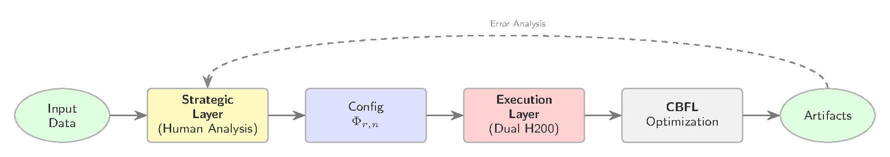
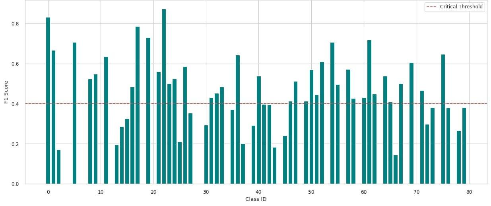
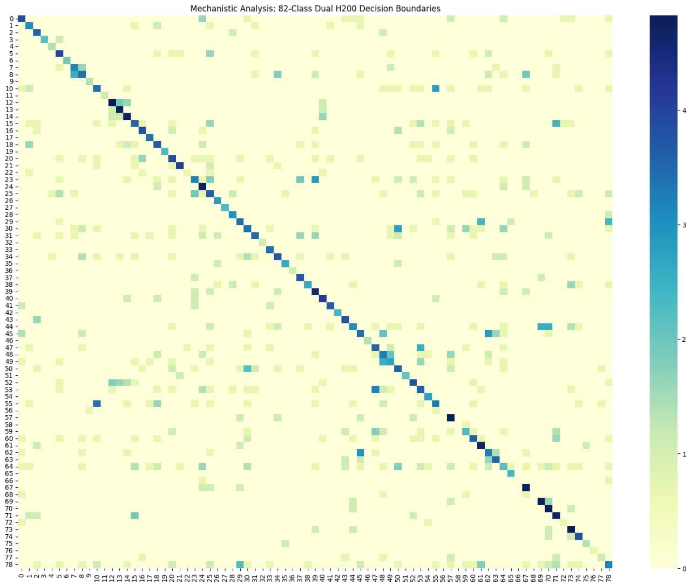
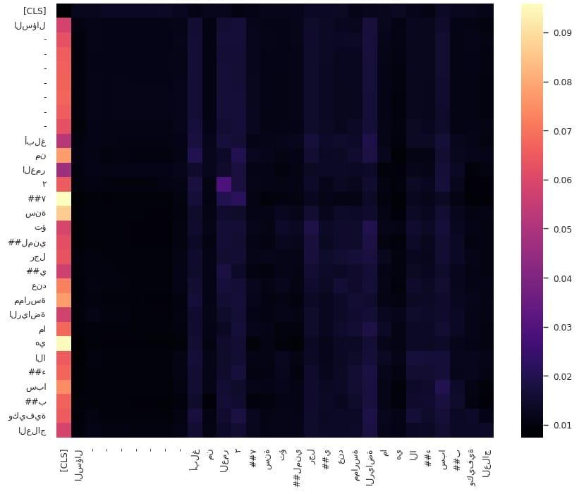

# [AbjadNLP 2026 @ EACL 2026] MetaSwarm at AbjadMed: Focal, Class-Balanced Optimization for Diglossic Medical Text in Abjad Scripts


Official code release for the AbjadNLP 2026 paper (co-located with EACL 2026).

> **TL;DR:** A CAMeLBERT-DA system with class-balanced focal loss and targeted oversampling of the 42 weakest classes, ensembled over five stratified folds, reaches 0.3588 public / 0.3520 private macro-F1 on the 82-class AbjadMed shared task.

<p align="center">
  
</p>

## Note on two versions

This repository follows the **updated author version**, which is not separately peer-reviewed.

## Links

📄 &nbsp;[Published version (ACL Anthology)](https://aclanthology.org/2026.abjadnlp-1.21/) &nbsp;|&nbsp; 🌐 &nbsp;[Project page](https://metaswarm-eacl-project.pages.dev) &nbsp;|&nbsp; 📄 &nbsp;[Paper, updated author version (PDF)](https://metaswarm-eacl-project.pages.dev/papers/metaswarm-author-version.pdf) &nbsp;|&nbsp; 🎞️ &nbsp;[Poster (PDF)](https://metaswarm-eacl-project.pages.dev/papers/metaswarm-eacl-poster.pdf) &nbsp;|&nbsp; 📊 &nbsp;[Slides (PPTX)](https://metaswarm-eacl-project.pages.dev/papers/metaswarm-slides.pptx)

## Contents

- [Note on two versions](#note-on-two-versions)
- [News](#news)
- [Results](#results)
- [Figures](#figures)
- [Repository structure](#repository-structure)
- [Submitted configuration](#submitted-configuration-table-1)
- [Setup](#setup)
- [Reproducing](#reproducing)
- [Reproducibility notes](#reproducibility-notes)
- [Acknowledgements](#acknowledgements)
- [Citation](#citation)
- [License](#license)

## News

- **[2026.09.19]** Code released: the five-stage development pipeline and the submitted five-fold ensemble.
- **[2026.03]** Paper published in the Proceedings of the 2nd Workshop on NLP for Languages Using Arabic Script (AbjadNLP 2026), Rabat, Morocco, co-located with EACL 2026 (pages 144-148).

## Results

| Split | Metric | Score |
|---|---|---|
| Public evaluation | Macro-F1 | 0.3588 |
| Private evaluation | Macro-F1 | 0.3520 |

Leaderboard (public and private, at competition close):

| System | Public macro-F1 | Private macro-F1 |
|---|---|---|
| Top systems (task overall) | 0.7422 | 0.6732 |
| BERT + kNN retrieval (best published system paper) | 0.4570 | 0.4902 |
| Class-balanced AraBERT + back-translation | 0.4066 | 0.4219 |
| MARBERTv2 | 0.3659 | 0.3648 |
| **MetaSwarm (this repository)** | **0.3588** | **0.3520** |

## Figures

<p align="center">
  
  <br><em>Per-class F1 across the 82 classes; 42 fall below the 0.40 line.</em>
</p>

<p align="center">
  
  <br><em>Confusion matrix (log-scaled), dual-H200 focal run.</em>
</p>

<p align="center">
  
  <br><em>Attention map for an Arabic medical query (last layer).</em>
</p>

The 82-class problem is long-tailed: the paper's Tail-42 audit shows that residual errors concentrate in 42 of 82 classes (per-class F1 below 0.40). The oversampling list used in training (`weak_indices` in the scripts below) is exactly that audit's output, and `src/latent_manifold.py` reproduces the audit.

## Repository structure

| Path | What it is |
|---|---|
| `src/train_weighted_ce.py` | Stage 1 development run: inverse-log-frequency weighted cross-entropy with label smoothing 0.1. Corresponds to the weighting configuration discussed in the paper's development stage (Eq. 1). |
| `src/train_focal.py` | Stage 2 development run: focal loss (gamma 2.0, alpha 0.25) on the oversampled training set, with confusion-matrix artifact generation. |
| `src/train_dual_h200.py` | Stage 3 scale-up of the focal configuration to the dual-H200 batch regime. |
| `src/train_five_fold_ensemble.py` | The submitted system: five-fold stratified ensemble, focal loss (gamma 2.5, alpha 0.25) with label smoothing 0.15, logit-mean aggregation. This is the submitted configuration (Table 1). |
| `src/latent_manifold.py` | Analysis script: UMAP projection of encoder [CLS] embeddings, attention saliency maps, and the per-class F1 audit that produces the weak-class list. |
| `data/README.md` | Expected data files, their schemas, and how to obtain them. |

## Submitted configuration (Table 1)

| Component | Setting |
|---|---|
| Backbone | CAMeLBERT-DA (110M), `CAMEL-Lab/bert-base-arabic-camelbert-da` |
| Hardware | Dual H200 (141 GB), serverless |
| Batch size | 256 (128 per GPU) |
| Precision | FP16 (mixed) |
| Optimizer | AdamW, LR 9e-5 |
| Seeds | 42 (all runs, splits, folds) |
| Schedule | Cosine, warmup 0.1, decay 0.01 |
| Focal gamma / alpha | 2.5 / 0.25 |
| Label smoothing | 0.15 |
| Max sequence length | 192 |
| Epochs (per fold) | 20 |
| Ensemble | 5 folds, logit mean |
| Oversampling | 42 weak classes, after split |

## Setup

```bash
pip install -r requirements.txt
```

Data files (see `data/README.md`) are expected in the working directory:

```text
shared_task_train.csv            columns: text, label
shared_task_devtest_no_label.csv columns: Id, text
```

The dataset is distributed by the AbjadMed shared task organizers and is not redistributed here.

## Reproducing

Single-GPU runs (each writes its submission file and figure artifacts as listed in the script header):

```bash
python src/train_weighted_ce.py
python src/train_focal.py
python src/train_dual_h200.py
```

Submitted system (five folds; global batch 256 assumes two GPUs):

```bash
python src/train_five_fold_ensemble.py
```

Analysis (run inside the training session; it expects the model, tokenized datasets, and trainer objects in scope, as in the development notebook):

```bash
python src/latent_manifold.py
```

Hardware notes. The ensemble script sets `per_device_train_batch_size=128` for two GPUs (global 256). On a single 80 GB-class GPU, keep the default and accept a longer run, or scale the learning rate accordingly. All other stages ran on a single H200.

## Reproducibility notes

- All validation splits derive from `shared_task_train.csv` with seed 42; the unlabeled evaluation file is used only for prediction. Exact replication starts from the organizer-distributed data files (see `data/README.md`).
- The reported scores were produced on H200-class hardware with FP16 mixed precision. Floating-point non-determinism across GPU generations, drivers, and library versions can shift macro-F1 by small amounts; the full configuration is documented above so that such variation can be interpreted.
- Each script reproduces its own stage's artifacts. The paper's headline numbers come from the five-fold ensemble (`src/train_five_fold_ensemble.py`); the single-run stages are the development and ablation runs, not scaled-down versions of the ensemble.
- The figures in the Figures section come from the paper; the scripts produce the same artifacts up to plot styling.

## Acknowledgements

This work builds on [CAMeLBERT-DA](https://huggingface.co/CAMEL-Lab/bert-base-arabic-camelbert-da) (CAMEL-Lab, Inoue et al., 2021). H200 compute came from Modal serverless GPUs (ARC AGI 2 Prize compute credits). Thanks to the AbjadMed shared task organizers and the AbjadNLP 2026 workshop committee.

## Citation

```bibtex
@inproceedings{jaisy2026metaswarm,
  title = {{M}eta{S}warm at {A}bjad{M}ed: Forensic Optimization and Class-Balanced Discovery for Medical Diglossia in Abjad Scripts},
  author = {Jaisy, Rahul},
  editor = {El-Haj, Mo and Rayson, Paul and Jarrar, Mustafa and Ezeani, Ignatius and Ezzini, Saad and Ahmadi, Sina and Haddad Haddad, Amal and Amol, Cynthia and Abdelali, Ahmad and Abudalfa, Shadi},
  booktitle = {Proceedings of the 2nd Workshop on {NLP} for Languages Using {A}rabic Script},
  month = mar,
  year = {2026},
  address = {Rabat, Morocco},
  publisher = {Association for Computational Linguistics},
  url = {https://aclanthology.org/2026.abjadnlp-1.21/},
  doi = {10.18653/v1/2026.abjadnlp-1.21},
  pages = {144--148}
}
```

## License

Released under the MIT License. See [LICENSE](LICENSE).
